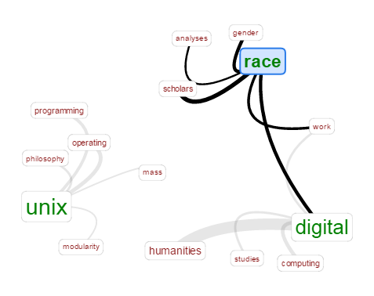
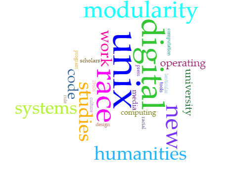

# Blog Post:
## Problems with Political Partisanship: A Criticism of Tara McPherson's "Why Are the Digital Humanities So White?"

  It is rather difficult to write about exactly what is wrong with Tara McPherson’s _“Why Are the Digital Humanities so White? or Thinking the Histories of Race and Computation.”_ How an academic essay whose title consists of a loaded question and a grammatically incoherent subtitle wasn’t rejected outright by peer review, let alone was published, is concerning in and of itself. The author’s use of the door-in-the-face technique to persuade the reader into accepting the premise of modularity in programming being symptomatic of institutional racism, without ever _explicitly_ tying the two concepts together (as can be seen when the most commonly used and commonly associated terms are placed in a web, as seen below), certainly gives off the impression of a more insidious intention behind the essay, regardless of whether or not it was intentional. 
  
 

  When McPherson writes, _“I found myself wondering why it seemed so hard to hold together my **long-standing** academic interests in race, gender, and certain modes of theoretical inquiry with my **more recent** (if decade-old) immersion in the world of digital production and design,”_ one does get the impression that the later field of study is much lower on her list of priorities and concerns than the former- a fact which brings into question how much of the essay may be colored by confirmation bias. The concern here is not that these ideas are being introduced to digital humanities, but rather that these ideological preoccupations appear to, rather than submit to scrutiny through the lens of digital humanities, instead appear to desire to _coopt_ the field of digital humanities as a means of expanding their influence. 

  This observation is certainly not without precedent. Kirschenbaum in particular has noted _“Digital humanities has also, I would propose, lately been galvanized by a group of younger (or not so young) graduate students, faculty members (both tenure line and contingent), and other academic professionals who now **wield the label “digital humanities” instrumentally** amid an increasingly monstrous institutional terrain defined by declining public support for higher education, rising tuitions, shrinking endowments, the proliferation of distance education and the for-profit university.”_ One can certainly understand and sympathize with the desire to remain relevant amid increasing hostility to the fields of study that have lately suffered from a public perception of becoming little more than pulpits for political activism. However, to do so by deliberately inserting and effectively indoctrinating these ideas into the canon of digital scholarship is simply academic parasitism that merely repackages the same concepts under a different name.

  This is especially egregious considering how openly hostile these interests have become towards existing ideas within digital humanist study. While McPherson’s essay itself merely casually inserts racial analysis into systematic processes, as seen in the visualization below (although she approaches dangerously close to equating module workload with slave labor), other scholars have been particularly adamant about their desire to see the entire focus of study shift exclusively towards their interests. Moya Bailey et al. even explicitly declare this to be the central purpose behind the hashtag movement “#transformDH,” as seen in their manifesto with the following three main claims: _“ 1. Questions of race, class, gender, sexuality, and disability **should be central to digital humanities** and digital media studies. 2. Feminist, queer, and antiracist activists, artists, and media-makers outside of academia are doing work that contributes to digital studies in all its forms. This work **productively destabilizes the norms and standards of institutionally recognized academic work.** 3. We should **shift the focus of digital humanities from technical processes to political ones,** and always seek to understand the social, intellectual, economic, political, and personal impact of our digital practices as we develop them.”_
  

  With such blatant declarations of the intent to coopt the field of digital humanities and use it as an astroturf for social justice, it becomes increasingly concerning how willingly digital humanities scholars wish to strip digital humanities of all nonpartisanship, and are so reluctant to acknowledge the increasingly controlling influence of this ideological front.  Wendy Hui Kyong Chun, in the roundtable of the dark side of DH, denies all culpability of political dogma devaluing and delegitimizing the field, claiming, _“The humanities are sinking—if they are—not because of their earlier embrace of theory or multiculturalism, but because… it sinks our students into debt… generated by this optimistic belief that a university degree automatically guarantees a job.”_ She then goes on to praise the “fabulous work” #transformDH is doing after insisting that the “dark side” of social reformation is “where we need to be.”

  Ultimately, though, we end up having to ask the question of whether or not social justice issues are digital humanities issues. There is certainly merit to that argument. However, that fact alone should not be used as an excuse to abandon any attempt at being objective or neutral. These issues can be analyzed without any particular foregone conclusions or assumptions. If these ideas become the central focus of the digital humanities, the “inclusivity” being preached for will rapidly become exclusivity by omission. How could this direction possibly attract right-leaning or centralists into becoming digital humanities scholars? And if they get alienated completely, then what kind of meaningful political debate can possibly occur in such a politically uniform study?

  After all, if digital humanities truly _are_ “white” and must be “cleaned” of its “whiteness,” exactly how welcoming will “non-white” digital humanities be to those whom they “overthrew?” 

### MLA Citations (click article title for link)

  McPhearson, Tara. ["Why Are the Digital Humanities So White? or Thinking the Histories of Race and Computation."](http://dhdebates.gc.cuny.edu/debates/text/29) _Debates in the Digital Humanities._ N.p., 2012. Web. 09 Mar. 2017.

  Kirschenbaum, Matthew. ["What Is Digital Humanities and What’s It Doing in English Departments?"](http://dhdebates.gc.cuny.edu/debates/text/38) _Debates in the Digital Humanities._ N.p., 2012. Web. 09 Mar. 2017.

  Bailey, Moya, Anne Cong-Huyen, Alexis Lothian, and Amanda Phillips. ["Reflections on a Movement: #transformDH, Growing Up"]  (http://dhdebates.gc.cuny.edu/debates/text/59) _Debates in the Digital Humanities._ N.p., 2016. Web. 09 Mar. 2017.
  
  Hui Kyong Chun, Wendy, Richard Grustin, Patrick Jagoda, and Rita Raley. ["The Dark Side of the Digital Humanities."](http://dhdebates.gc.cuny.edu/debates/text/89) _Debates in the Digital Humanities._ N.p., 2016. Web. 09 Mar. 2017.
