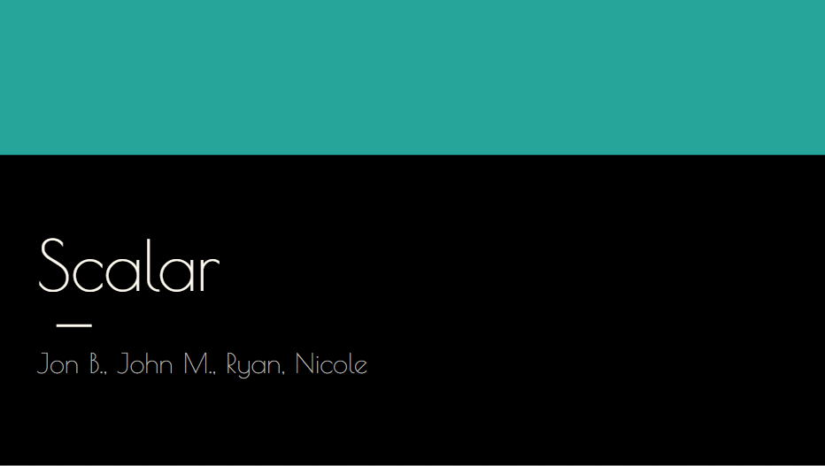

# Collaborative Project: Scalar

## Project Description:

For our collaborative research project, we investigated the Scalar digital publishing tool. We found that it is essentially a digital publishing platform somewhat similar to Github or WordPress, except Scalar was designed for the specific purpose of digital scholarship and publishing academic papers in a natively digital and/or hypertextual environment. We found we could create a Scalar hypertext piece fairly easily, and were able to add a few sample pages with our presentation. We also investigated the origins of the Alliance for Networking Visual Culture, Scalar’s creators, which founded a year prior to the first public demonstration of the Scalar platform.

## Collaboration Statement

Our group decided to take on a “divide-and-conquer” approach to this research assignment, where we split the various necessary data points for each of us to work on independently of each other, and then put them together for our presentation. My contribution was to research the background of the project, as well as to provide details regarding the creators (shown here by the two content slides depicted here). My own research into the archived blog posts suggested that the organization that created Scalar (the ANVC) was actually only founded roughly the same time one would expect development on Scalar would have begun, suggesting that developing Scalar was the primary purpose of the Alliance. Although we used the Google Slides tool to organize and present our project, with many opportunities for collaboration, we found that none of us had any particular interest in coordination or communication. There were no “appointed” group roles, so we simply chose to each handle one specific aspect of the assignment and trust the other group members to each provide their best work. This is the reason how Nicole ended up actually basing her information off of an entirely different Scalar than the one we were supposed to be researching, and nobody among us corrected her. We were given no framework from which to base our approach to group research on, and the results were dismal and disjointed. Consequently, I feel that this project failed to either “enrich [my] academic thinking,” or “advance [my] stated research agenda” whatsoever.

